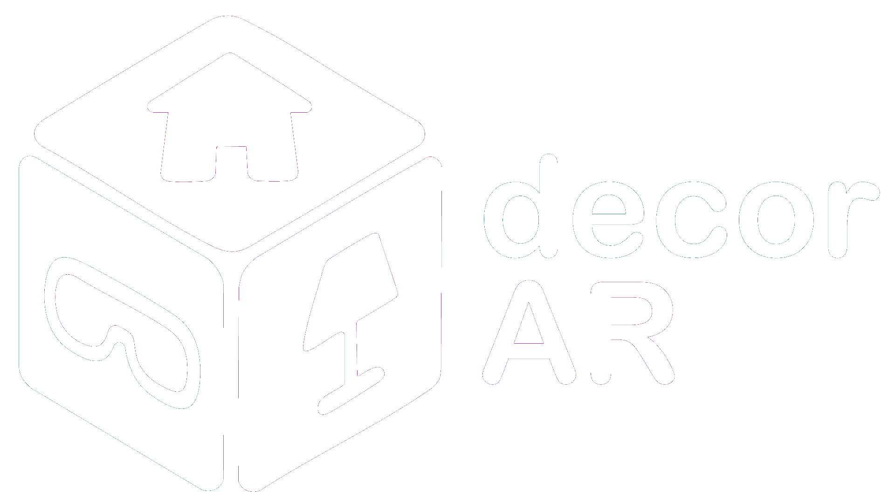

#  Decor-AR

Una aplicación donde usuarios los decoradores de interiores pueden mostrar sus ideas, asi como buscar inspiracion de otros usuarios. Evita que tus clientes tengan que imaginar como quedaria su nueva casa amueblada y muestraselos directamente usando la realidad aumentada.

## Características ⭐
- Visualización de muebles en realidad aumentada
- Carga de muebles personalizados

## Librerías Utilizadas 📚
- Arcore (realidad aumentada)
- HiltAndroid (inyección de dependencias)
- Room (base de datos)
- Vico (gráficos)
- Material3 (UI)

### Imagenes
